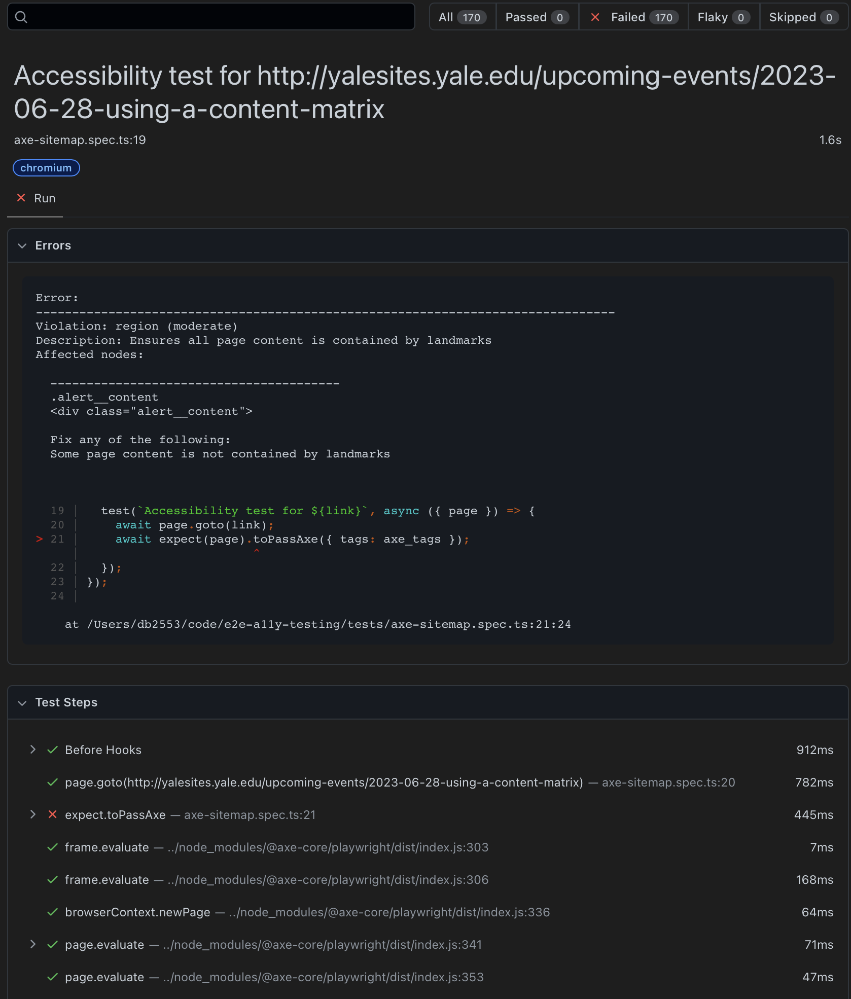

# e2e-a11y-testing

Recommended end-to-end accessibility testing for web projects.




## Requirements

* [nodejs: >= 16](https://nodejs.org/en)
* [npm](https://www.npmjs.com)
* [xmllint](https://gitlab.gnome.org/GNOME/libxml2/-/wikis/home)

## Installation

To install, you'll need to clone the repository locally and change to the root
directory of it.  Then run the following commands:

### For `npm`

```bash
npm install
npx playwright install
```

## Running tests

To run axe tests on a remote site containing a sitemap.xml file:

```bash
npm run a11y <base_url>
```

`base_url`: The url of the site containing the sitemap.xml file (i.e.
https://www.example.com)

To retrieve the sitemap links into a file called `sitemap.links`:
```bash
npm run sitemap <base_url>
```

`base_url`: The url of the site containing the sitemap.xml file (i.e.
https://www.example.com)

To run axe tests against one specific URL:
```bash
npm run ally <url>
```

`url`: The url in this case is the actual page you'd like to test (i.e. https://www.example.com/about_us)

To manually run all tests:

```bash
npx playwright test
```

To manually run a specific test file:

```bash
npx playwright test <relative_path_to_file>
```

To run visual regression tests on a sitemap:
```bash
npm run visreg <base_url>
```
`base_url`: The url of the site containing the sitemap.xml file (i.e.
https://www.example.com)

To run visual regression tests on one URL:
```bash
npm run visreg <url>
```

`url`: The url in this case is the actual page you'd like to test (i.e. https://www.example.com/about_us)

Note: The first time you run the visual regression, it'll attempt to create
baselines to test against.  The times after that will be actual comparisons to
the original.

### Coming soon

- Prettier output of issues

#### How to Contribute

We welcome contributions from the community to make this project better.
Whether you want to report a bug, request a feature, or submit code changes, we
appreciate your help! Please take a moment to review this guide on how to
contribute to our repository.

#### Reporting Issues

If you encounter a bug, have a feature request, or want to discuss something
related to the project, please [open an
issue](https://github.com/Yale-A11y/e2e-a11y-testing/issues) on our GitHub
repository. When creating an issue, please provide as much detail as possible,
including:

- A clear and concise title.
- A detailed description of the problem or suggestion.
- Steps to reproduce the issue (if applicable).
- Information about your environment (e.g., operating system, browser, version).

This information helps us understand and address your concern more effectively.

#### Making Code Contributions

We encourage contributions from the community in the form of code, bug fixes,
or new features. To contribute code, follow these steps:

1. Fork the repository by clicking the "Fork" button on the top right of this
   page.
2. Clone your forked repository to your local machine:
    ```bash
    git clone https://github.com/your-username/e2e-a11y-testing.git
    ```
3. Create a new branch for your changes:
    ```bash
    git checkout -b my-feature-branch
    ```
4. Make your changes.
5. Test your changes thoroughly to ensure they work as expected.
6. Commit your changes with a descriptive commit message:
    ```bash
    git commit -m "Add new feature: your feature description"
    ```
7. Push your changes to your forked repository:
    ```bash
    git push origin my-feature-branch
    ```
8. Open a pull request (PR) by visiting the original repository and clicking
   the "New Pull Request" button. Provide a clear title and description for
   your PR, explaining the changes you made.

## Code Review Process

Once you've submitted a pull request, our team will review your changes. We may
provide feedback or request additional changes before merging. Please be
patient during this process, as it may take some time.

Thank you for considering contributing to our project! Your help is greatly
appreciated, and together we can make this project even better.

